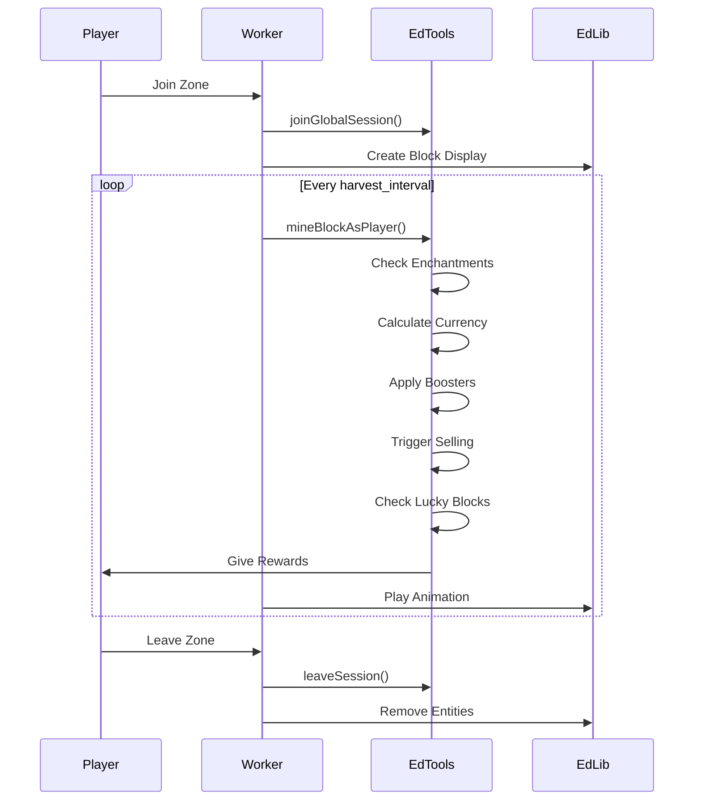

# AfkZoneEdtools - Integration Guide for Developers

## EdTools API Integration

This document provides detailed information about how AfkZoneEdtools integrates with EdTools APIs to achieve complete parity with normal EdTools zones.

## Core Integration Architecture

### 1. Zone Session Management

**Purpose**: Integrate AFK zones with EdTools' zone session system

**Implementation**:
```java
// Join global session (shared zone instance)
zonesAPI.joinGlobalSession(player, zoneId);

// Join alone session (private zone instance)
zonesAPI.joinAloneSession(player, zoneId);

// Set block type for zone
zonesAPI.setPlayerBlocksTypeZone(player, zoneId, blockType);
```

**Key Points**:
- Sessions must be active before mining blocks
- Block type determines what blocks appear in the zone
- Sessions persist until player leaves or disconnects

### 2. Critical Mining Method: mineBlockAsPlayer()

**Purpose**: Mine blocks with FULL EdTools integration - currency, enchants, selling, lucky blocks

**Implementation**:
```java
APIPair<Material, String> result = zonesAPI.mineBlockAsPlayer(
    player,                    // The player
    blockPosition,             // Block location
    toolId,                    // OmniTool ID (must match player's actual tool)
    affectEnchants,           // true = activate enchantments
    affectSell,               // true = trigger selling
    affectBlockCurrencies,    // true = give currency rewards
    affectLuckyBlocks         // true = trigger lucky blocks
);
```

**Critical Flags**:
- `affectEnchants = true` → Activates tool enchantments as if farming manually
- `affectSell = true` → Triggers EdTools selling mechanics
- `affectBlockCurrencies = true` → Gives currency rewards based on blocks
- `affectLuckyBlocks = true` → Enables lucky block mechanics

**Why This is Critical**:
This single method call ensures AFK zones function EXACTLY like normal EdTools zones. All EdTools features (currency, boosters, enchants, selling, lucky blocks, leveling) are automatically handled.

### 3. Currency System Integration

**Purpose**: Give currency rewards with booster support

**Implementation**:
```java
// Get booster multiplier
double multiplier = boostersAPI.getBoosterValueByEconomy(playerId, currency);

// Add currency with boosters
currencyAPI.addCurrency(playerId, currency, amount, true);

// Get player's currency
double balance = currencyAPI.getCurrency(playerId, currency);
```

**Key Points**:
- Always use `affectBoosters = true` for AFK farming
- Boosters are automatically applied by mineBlockAsPlayer()
- Currency rewards scale with block rarity and zone configuration

### 4. Enchantment System Integration

**Purpose**: Activate tool enchantments during AFK farming

**Implementation**:
```java
// Enchantments are activated automatically via mineBlockAsPlayer()
// with affectEnchants = true

// Get enchant level
double level = enchantAPI.getEnchantLevel(playerId, enchantId);

// Get enchant chance
double chance = enchantAPI.getEnchantChance(playerId, enchantId);
```

**Supported Enchantments**:
- TNT Enchant: Explosive mining
- Lightning Enchant: Strike mining
- Multi-Break Enchants: Mine multiple blocks
- Luck Enchants: Bonus rewards
- Custom Enchants: All registered enchants

**Key Points**:
- Enchants proc based on their configured chance
- Enchant effects are triggered automatically
- Tool must have enchantments configured in EdTools

### 5. Booster System Integration

**Purpose**: Apply all EdTools boosters to AFK farming

**Implementation**:
```java
// Get currency booster
double currencyBooster = boostersAPI.getBoosterValueByEconomy(playerId, currency);

// Get enchant booster
double enchantBooster = boostersAPI.getBoosterValueGlobalEnchants(playerId);

// Get active boosters
List<String> activeBoosters = boostersAPI.getActiveBoosters(playerId);
```

**Booster Types**:
- Currency Boosters: Multiply currency rewards
- Enchant Boosters: Increase enchant proc chance
- Global Boosters: Affect all activities
- Zone-Specific Boosters: Only for specific zones

**Key Points**:
- Boosters are automatically applied by mineBlockAsPlayer()
- Multiple boosters stack multiplicatively
- AFK zones respect all booster configurations

### 6. OmniTool Integration

**Purpose**: Use player's actual tools with their enchantments

**Implementation**:
```java
// Get player's tool from hand
ItemStack tool = omniToolAPI.getOmniToolFromPlayer(player);

// Get tool ID
String toolId = omniToolAPI.getOmniToolId(tool);

// Check if item is an OmniTool
boolean isOmniTool = omniToolAPI.isItemOmniTool(item);

// CRITICAL: Use the same tool ID in mineBlockAsPlayer()
zonesAPI.mineBlockAsPlayer(player, position, toolId, true, true, true, true);
```

**Key Points**:
- Tool ID must match player's actual equipped tool
- Tool enchantments are automatically used
- Tool durability is NOT consumed (AFK farming)
- Tool must be in allowed_tools list for the zone

### 7. Sell System Integration

**Purpose**: Automatically sell mined items through EdTools

**Implementation**:
```java
// Selling is handled automatically via mineBlockAsPlayer()
// with affectSell = true

// Manual selling
sellAPI.sellItem(playerId, itemId, amount);

// Add to sell summary
sellAPI.addSellSummary(playerId, currencyId, amount);

// Get sell summary
double totalSold = sellAPI.getSellSummary(playerId, currencyId);
```

**Key Points**:
- Items are automatically sold based on EdTools sell configuration
- Sell prices are determined by EdTools
- Sell summary tracks total earnings

### 8. Lucky Block Integration

**Purpose**: Trigger lucky block mechanics during AFK farming

**Implementation**:
```java
// Lucky blocks are triggered automatically via mineBlockAsPlayer()
// with affectLuckyBlocks = true

// Check if item is lucky block
boolean isLuckyBlock = luckyBlocksAPI.isLuckyBlock(item);

// Get lucky block item
ItemStack luckyBlock = luckyBlocksAPI.getLuckyBlockItem(id, owner);
```

**Key Points**:
- Lucky blocks have a chance to spawn during mining
- Rewards are configured in EdTools
- AFK zones respect lucky block configuration

### 9. Leveling System Integration

**Purpose**: Grant experience and levels from AFK farming

**Implementation**:
```java
// Add level/experience
levelingAPI.addLevel(playerId, levelId, amount);

// Get player's level
double level = levelingAPI.getLevel(playerId, levelId);

// Get level rewards
List<String> rewards = levelingAPI.getForEachRewards(levelId);
Map<Double, List<String>> intervalRewards = levelingAPI.getIntervalRewards(levelId);
```

**Level Types**:
- `mining-level`: For mining zones
- `farming-level`: For farming zones
- Custom level types

**Key Points**:
- Experience is granted based on harvests
- Level-up rewards are automatically given
- AFK farming contributes to progression

### 10. Backpack Integration

**Purpose**: Store and manage items in EdTools backpacks

**Implementation**:
```java
// Get backpack items
Map<String, Double> items = backpackAPI.getBackpackItems(playerId);

// Sell backpack items
backpackAPI.sellBackpackItems(player);

// Get backpack weight
double weight = backpackAPI.getBackpackWeight(playerId);
```

**Key Points**:
- Mined items can be stored in backpacks
- Backpack upgrades increase capacity
- Items can be batch-sold

## EdLib Integration

### 1. Block Display System

**Purpose**: Visual block representation using packet-based displays

**Implementation**:
```java
// Create block display
Matrix4f transformation = new Matrix4f().identity().scale(1.0f);
EdEntity blockDisplay = edLibAPI.createBlockDisplay(location, transformation, material);

// Set glow effect
blockDisplay.setGlowing(EdColor.YELLOW);

// Spawn for all players
blockDisplay.spawn();

// Update transformation (animation)
Matrix4f newTransform = new Matrix4f().identity().scale(0.1f);
blockDisplay.setTransformationWithInterpolation(newTransform, 10, 0);
```

**Key Points**:
- Block displays are visual only
- Transformations are used for animations
- Async operations for performance

### 2. Worker Entity System

**Purpose**: Create AFK workers using packet-based entities

**Implementation**:
```java
// Create entity
EdEntity worker = edLibAPI.createEntity(EntityType.VILLAGER, location);

// Configure entity
worker.setDisplayName("Worker");
worker.setInvisible();

// Spawn for player
worker.spawnForPlayer(player);

// Remove entity
worker.remove();
```

**Key Points**:
- Workers are visual representations
- Packet-based for performance
- Entities are per-player (not shared)

### 3. Goal System for AI

**Purpose**: Control worker movement and behavior

**Implementation**:
```java
// Create movement goal
EdGoalMove moveGoal = new EdGoalMove(targetPosition, speed);

// Add goal to entity
worker.addGoal(moveGoal);

// Start goal execution
worker.startNextGoal();
```

**Available Goals**:
- `EdGoalMove`: Move to position
- `EdGoalOrbit`: Orbit around point
- `EdGoalDelay`: Wait for duration
- `EdGoalFollowEntity`: Follow entity

**Key Points**:
- Goals are queued and executed sequentially
- Custom goals can be created
- Async execution for performance

## Complete Integration Flow

### AFK Zone Harvesting Sequence



## Best Practices

### 1. Always Use Async Operations
```java
Bukkit.getScheduler().runTaskAsynchronously(plugin, () -> {
    // EdLib operations
    // EdTools API calls
});
```

### 2. Proper Error Handling
```java
try {
    zonesAPI.mineBlockAsPlayer(player, position, toolId, true, true, true, true);
} catch (Exception e) {
    plugin.getLogger().severe("Error mining block: " + e.getMessage());
}
```

### 3. Resource Cleanup
```java
@Override
public void onDisable() {
    // Remove all workers
    workerManager.shutdown();
    
    // Remove all entities
    blockManager.cleanup();
    
    // Leave all sessions
    for (Player player : Bukkit.getOnlinePlayers()) {
        edToolsIntegration.leaveZoneSession(player);
    }
}
```

### 4. Performance Monitoring
```java
if (plugin.getConfigManager().isDebugEnabled()) {
    long startTime = System.currentTimeMillis();
    // Operation
    long duration = System.currentTimeMillis() - startTime;
    plugin.getLogger().info("Operation took " + duration + "ms");
}
```

## Event System

### EdTools Events

```java
@EventHandler
public void onCurrencyAdd(EdToolsCurrencyAddEvent event) {
    // Modify currency amount
    event.setAmount(event.getAmount() * 2);
    
    // Add multiplier
    event.addMultiplier(1.5);
}

@EventHandler
public void onEnchantProc(EdToolsEnchantTryProcEvent event) {
    // Modify enchant chance
    event.setChance(event.getChance() * 1.2);
}

@EventHandler
public void onBlockBreak(EdToolsBreakBlockEvent event) {
    // Handle block break
    Player player = event.getPlayer();
    Material material = event.getMaterial();
    String toolId = event.getToolId();
}
```

## API Extensions

### Creating Custom Enchants

```java
public class CustomAfkEnchant implements APIEnchant {
    @Override
    public void onProc(Player player, EnchantData data) {
        if (!(data instanceof CustomEnchantData)) return;
        
        CustomEnchantData customData = (CustomEnchantData) data;
        Material material = customData.getMaterial();
        Vector position = customData.getPosition();
        
        // Custom enchant logic
        // Use EdLib for visual effects
        // Use EdTools APIs for rewards
    }
}

// Register enchant
edToolsAPI.getEnchantAPI().registerEnchant("custom_afk_enchant", new CustomAfkEnchant());
```

## Troubleshooting Integration Issues

### Issue: mineBlockAsPlayer() Not Giving Rewards
**Check**:
1. All flags are set to `true`
2. Player has active zone session
3. Tool ID matches player's actual tool
4. Block position is valid
5. EdTools currency is configured

### Issue: Enchantments Not Activating
**Check**:
1. `affectEnchants = true`
2. Player's tool has enchantments
3. Enchant chance is > 0
4. EdTools enchantments are configured
5. Tool ID is correct

### Issue: Boosters Not Applying
**Check**:
1. `applyBoosters = true` in zone config
2. Player has active boosters
3. Booster currency matches zone currency
4. EdTools boosters are configured

---

**This integration ensures AFK zones function EXACTLY like normal EdTools zones with complete feature parity.**
